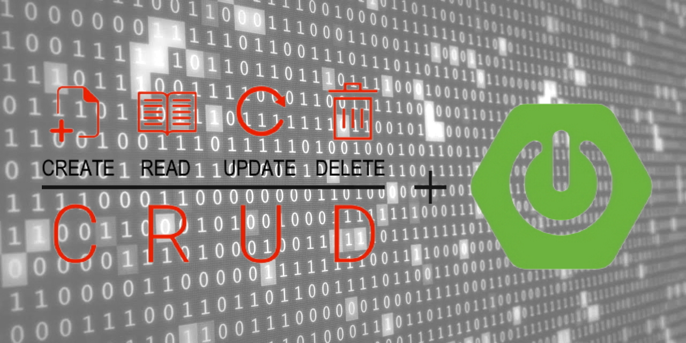
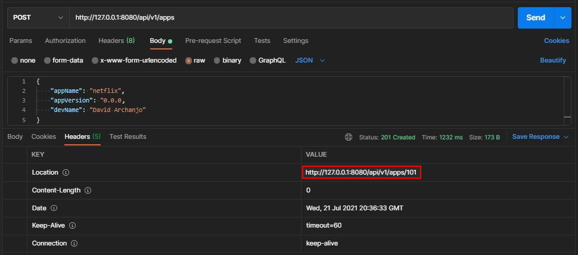
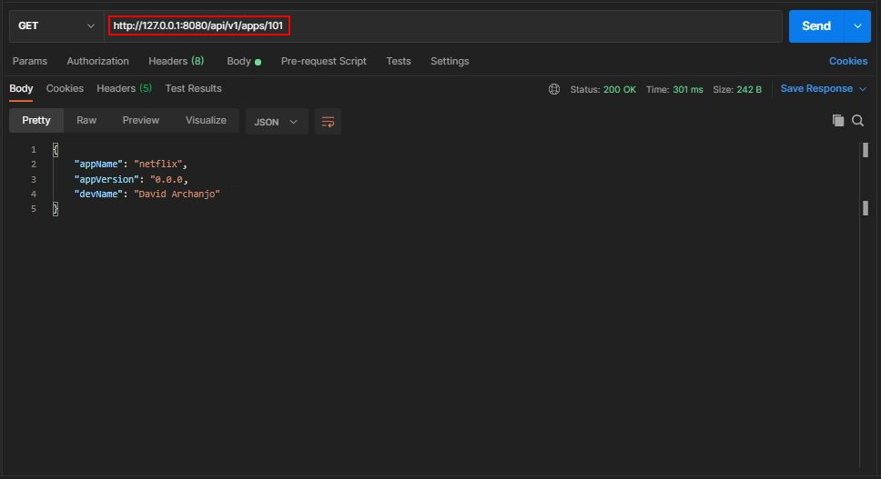
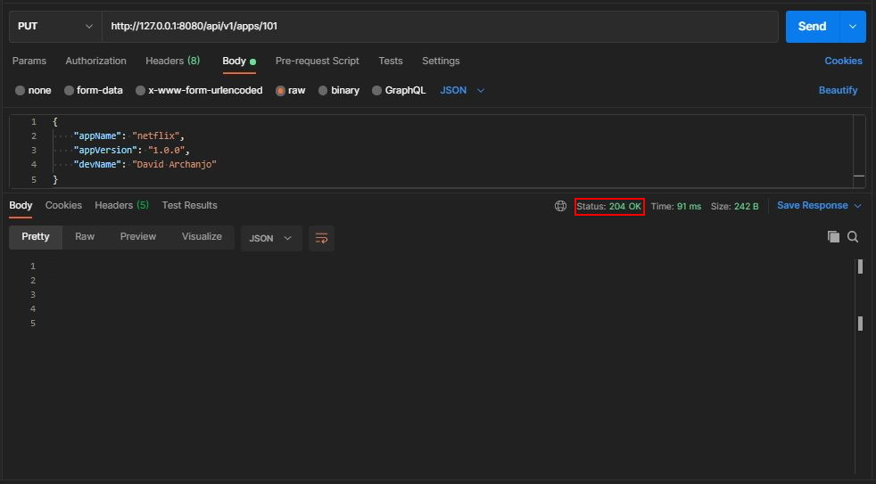
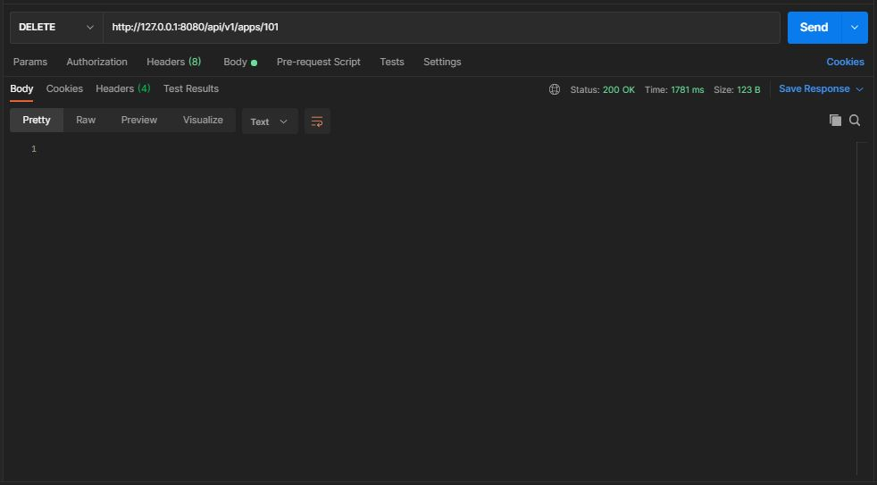
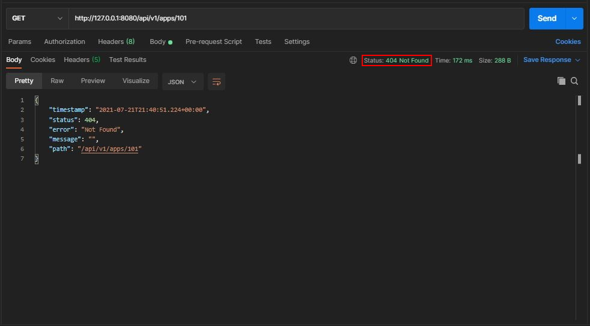

# Spring Boot CRUD Application



## Introduction

### Spring Boot

[Spring Boot](https://spring.io/projects/spring-boot) is one of the most famous [Spring](https://spring.io/projects/spring-framework) project used nowadays. It came to facilitate the process of configuring and publishing enterprise applications. It helps create stand-alone, production-grade Spring based applications with minimal effort. **Spring Boot** was conceived to be an "opinionated framework" because it follows an opinionated default configuration approach which reduces the developer efforts configuring the application.

Each application built using **Spring Boot** needs merely to define a Java class annotated with `@SpringBootApplication` as its main entry point. This annotation encapsulates the following other annotations:

- `@Configuration` – marks the class as a source of bean definitions.
- `@EnableAutoConfiguration` – indicates to the framework to add beans based on the dependencies on the classpath automatically.
- `@ComponentScan` – scans for other configurations and beans in the same package as the Application class or below.

### CRUD Application

The most common way to start using **Spring Boot** is by implementing a CRUD (a.k.a **C**reate, **R**ead, **U**pdate, **D**elete) REST application. I particularly consider it a "Hello World" when it comes to microservice frameworks, because most of what it is used for is related to building APIs. **_A CRUD application essentially contains the very basic functionalities that every API could have._**

1. `Create New App`

- URL: http://127.0.0.1:8085/api/v1/apps
- HTTP Method: POST
- Body:
  ```json
  {
    "appName": "netflix",
    "appVersion": "0.0.0",
    "devName": "David Archanjo"
  }
  ```
  
  **NOTE:** According to [RFC standard](https://www.w3.org/Protocols/rfc2616/rfc2616-sec10.html), we should return a 201 HTTP status on creating the request resource successfully. In most of the applications the id of the newly created resource is generated, so it is a good practice to return it. To do so, the newly created resource can be referenced by the URI(s) returned in the entity of the response, with the most specific URI for the resource given by a `Location` header field. According to outlined in the screenshot, it returns accordingly at the response header.

2. `Get App by ID`

- URL: http://127.0.0.1:8085/api/v1/apps/{appId}
- HTTP Method: GET
  
  **NOTE:** According to outlined in the screenshot, we are using the URI provided in the header from the response of the previous request.

3. `Update App`

- HTTP Method: PUT
- URL: http://127.0.0.1:8085/api/v1/apps/{appId}
- Body:
  ```json
  {
    "appName": "netflix",
    "appVersion": "1.0.0",
    "devName": "David Archanjo"
  }
  ```
  
  **NOTE:** According to [RFC 2616](http://www.w3.org/Protocols/rfc2616/rfc2616.html) at [Section 9.6](http://www.w3.org/Protocols/rfc2616/rfc2616-sec9.html#sec9.6), for a response with **_no body_** upon a successful PUT request, it should be returned a 204 HTTP status code, according to outlined in the screenshot.

4. `Delete App`

- HTTP Method: DELETE
- URL: http://127.0.0.1:8085/api/v1/apps/{appId}
  

  If we try to look up the deleted application by its id we will get an HTTP 404 status code response:
  
